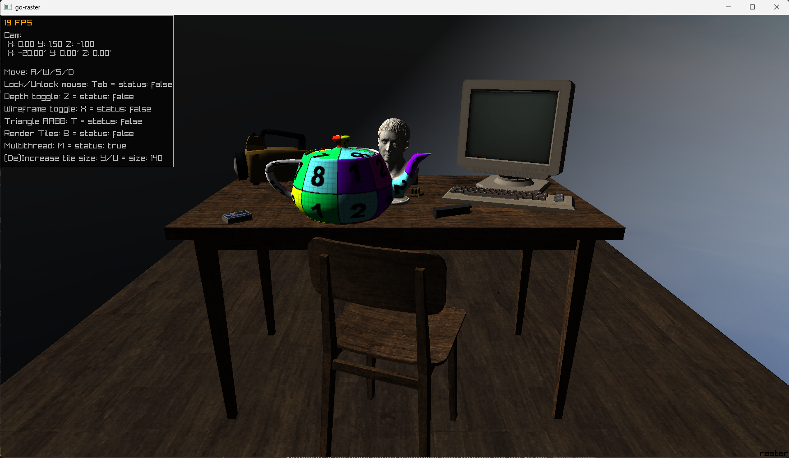
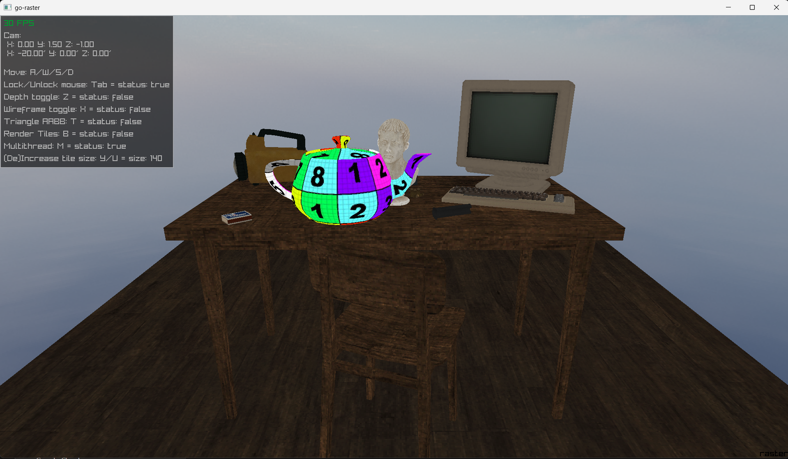
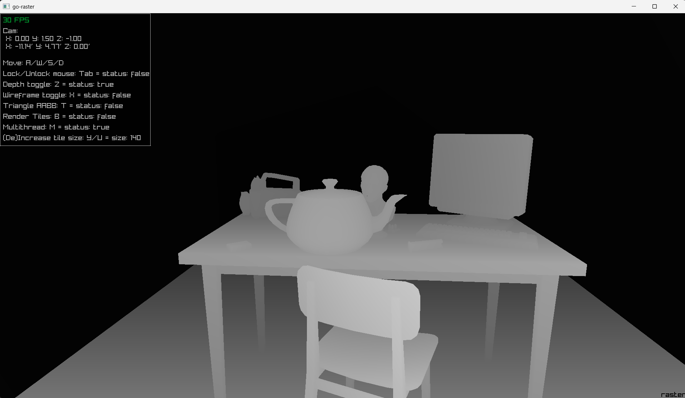

# Tile Based Multithreaded Software Rasterizer in Go

Calculations done by software and passed to an array of Colors to be render on a texture the size of the screen with auto resize calculation. Using [raylib-go](https://github.com/gen2brain/raylib-go) bindings to [raylib](https://github.com/raysan5/raylib)

Rasterizer implementation using barycentric coordinates.

-   [x] Draw Lines
-   [x] Draw Filled Triangle
-   [x] Shaded Triangle
-   [x] Perspective Projection
-   [x] Describing and rendering a scene (With camera controls)
-   [x] Clipping
    -   [x] Full frustum culling - Near, far, left, right, top and bottom planes.
    -   [x] Automatically calculate frustum on screen resize.
    -   [x] Dynamic mesh generation on clipping plane. (Sutherland–Hodgman algorithm)
-   [x] Back face culling
-   [x] Depth buffer
-   [x] Simple OBJ parser
    -   [x] Vertex data
    -   [x] Normal data
        -   [x] Render using normal data
    -   [x] UV data
    -   [x] Shader smooth
-   [x] Normal map
-   [x] Roughness/Specular map
-   [x] Texture
    -   [x] Perspective corrected rendering
    -   [ ] Transparency
-   [x] Shading
    -   [x] Phong / Blinn Phong
    -   [x] Lights
        -   [x] Directional light
        -   [ ] Point light
        -   [ ] Spot light
    -   [ ] Shadow map
-   [ ] More...

# Building

It uses `go 1.26`, so just `git clone` and `go mod tidy`, obviously it need CGO because of raylib.
With this in mind, just do the following;

-   build process expects a `dist` directory, so, you should create it `mkdir dist`(on powershell all command will work as expected).

Windows(Powershell);
```bash
$ .\buildrunRay.ps1
```
Or

Linux
```bash
$ .\buildAndRunRay.sh
```

# Showcase

## Simple scene with single directional light



## Simple scene without lighting



## Depth buffer

